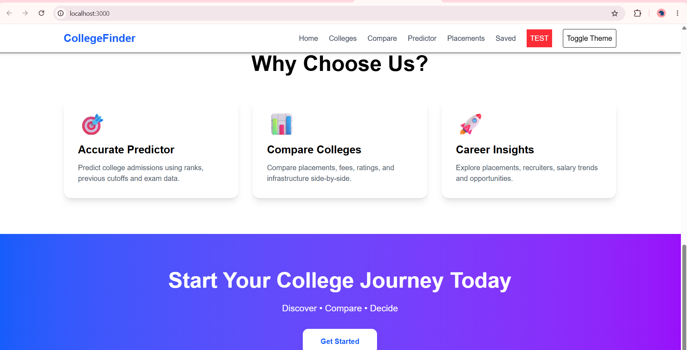

# 🎓 College Discovery Platform

A web application to help students explore and discover colleges easily based on preferences like course, location, and ranking.

---

## 🚀 Features

- Search and filter colleges
- View college details
- User-friendly UI
- Fast and responsive design
- Built with modern web technologies

---

## 🛠️ Tech Stack

- Next.js
- React.js
- Node.js
- JavaScript / TypeScript
- CSS / Tailwind (if used)

---

## 📸 Screenshots

Add screenshots below:

### Home Page


### College Listing Page


---

## 📂 Project Setup

```bash
git clone https://github.com/aditijodh28/college-discovery-platform.git
cd college-discovery-platform
npm install
npm run dev
